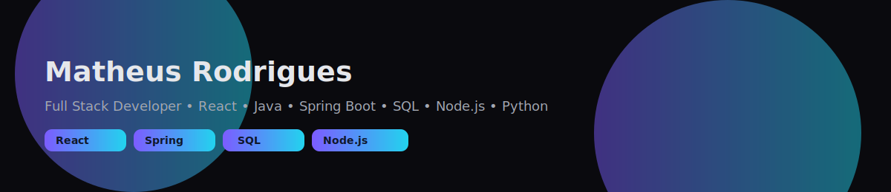

<!-- Typing SVG -->

---

## 👋 Olá, eu sou o Matheus Rodrigues  

💻 **Desenvolvedor Full Stack** apaixonado por criar aplicações modernas, performáticas e elegantes.  
Trabalho com **React, Java, Spring Boot, SQL, Node.js e Python**, construindo desde o back-end até o front-end.  

* 🌍  Baseado no **Brasil**  
* ✉️  Contato: **[matheusnascimentobr93@gmail.com](mailto:matheusnascimentobr93@gmail.com)**  

---

## 🌐 Socials

 
  <a href="https://github.com/MatheusBr93" target="_blank">
    <img src="h
